<div align="center">

# 🏛️ AI-Powered Egyptian Tourism Platform

### *Intelligent Visual Tour Guide — Powered by CLIP + FAISS + RAG*

[](https://python.org)
[](https://fastapi.tiangolo.com)
[](https://react.dev)
[](https://dotnet.microsoft.com)
[](https://docker.com)
[](LICENSE)
[]()

<br/>

> Upload a photo of any Egyptian monument — get instant AI-generated historical context,  
> powered by Visual Retrieval-Augmented Generation.

<br/>

**[🚀 Live Demo](#)** &nbsp;·&nbsp; **[📄 Proposal](docs/AI_Tourism_Proposal.pdf)** &nbsp;·&nbsp; **[🐛 Report Bug](../../issues)**

</div>

---

## 📋 Table of Contents

- [Overview](#-overview)
- [Features](#-features)
- [Tech Stack](#-tech-stack)
- [System Architecture](#-system-architecture)
- [UML Diagrams](#-uml-diagrams)
  - [Class Diagram](#1-class-diagram)
  - [Entity Relationship Diagram](#2-entity-relationship-diagram)
  - [Use Case Diagram](#3-use-case-diagram)
  - [Sequence Diagram — AI Pipeline](#4-sequence-diagram--ai-pipeline)
  - [Sequence Diagram — Authentication](#5-sequence-diagram--authentication)
  - [Activity Diagram — AI Analysis](#6-activity-diagram--ai-analysis)
  - [Activity Diagram — Itinerary](#7-activity-diagram--itinerary-planning)
  - [Component Diagram](#8-component-diagram)
  - [Deployment Diagram](#9-deployment-diagram)
  - [State Machine — AI Query](#10-state-machine--ai-query)
  - [State Machine — User Session](#11-state-machine--user-session)
- [Project Structure](#-project-structure)
- [Getting Started](#-getting-started)
- [Team](#-team)
- [Milestones](#-milestones)

---

## 🌟 Overview

The **AI-Powered Egyptian Tourism Platform** is a graduation project that brings Egypt's ancient heritage to life through artificial intelligence. Users can explore all Egyptian governorates, browse thousands of archaeological sites, and use our AI visual assistant to identify monuments and receive rich historical descriptions — all in real time.

The core innovation is a **Visual RAG (Retrieval-Augmented Generation)** pipeline:

```
Upload Image  →  CLIP Encoding  →  FAISS Vector Search  →  LLM Generation  →  Historical Description
```

---

## ✨ Features

| Feature | Description | Status |
|---|---|---|
| 🗺️ **Governorate Explorer** | Browse all 27 Egyptian governorates with sites & landmarks | ✅ Planned |
| 🤖 **AI Monument Identifier** | Upload image → instant historical description | ✅ Core Feature |
| 🔍 **Smart Search** | Filter sites by era, type, region | ✅ Planned |
| 📅 **Itinerary Builder** | Plan custom multi-day tours | ✅ Planned |
| ⭐ **Reviews & Ratings** | Community-driven site ratings | ✅ Planned |
| 🌐 **Multi-language** | Arabic & English support | 🔄 In Progress |
| 📄 **PDF Export** | Export AI reports as branded PDFs | ✅ Done |

---

## 🛠️ Tech Stack

| Layer | Technology |
|---|---|
| **AI / Vision** | OpenAI CLIP (ViT-B/32), FAISS, PyTorch, Transformers, LLM |
| **AI Service** | Python 3.12, FastAPI |
| **Backend** | .NET 8 / ASP.NET Core, PostgreSQL, Redis |
| **Frontend** | React 18, Vite, Tailwind CSS, React Query |
| **DevOps** | Docker, Docker Compose, AWS ECS/S3/RDS, GitHub Actions |

---

## 🏗️ System Architecture

```
┌─────────────────────────────────────────────────────────┐
│                      CLIENT LAYER                       │
│                   React.js Frontend                     │
└──────────────────────────┬──────────────────────────────┘
                           │ HTTPS / REST
┌──────────────────────────▼──────────────────────────────┐
│               API GATEWAY  (FastAPI)                    │
│              Auth  ·  Rate Limit  ·  Routing            │
└──────┬───────────────────┬───────────────────┬──────────┘
       │                   │                   │
┌──────▼──────┐  ┌─────────▼──────┐  ┌────────▼────────┐
│  .NET API   │  │  AI Service    │  │  Search Service │
│ Sites/Users │  │  Python/Torch  │  │   Full-text     │
└──────┬──────┘  └────────┬───────┘  └────────┬────────┘
       │                  │                    │
       │         ┌────────▼────────┐           │
       │         │   RAG PIPELINE  │           │
       │         │ CLIP→FAISS→LLM  │           │
       │         └─────────────────┘           │
       │                                       │
┌──────▼───────────────────────────────────────▼──────────┐
│                      DATA LAYER                         │
│         PostgreSQL  ·  Redis  ·  AWS S3                 │
└─────────────────────────────────────────────────────────┘
```

---

## 📐 UML Diagrams

### 1. Class Diagram

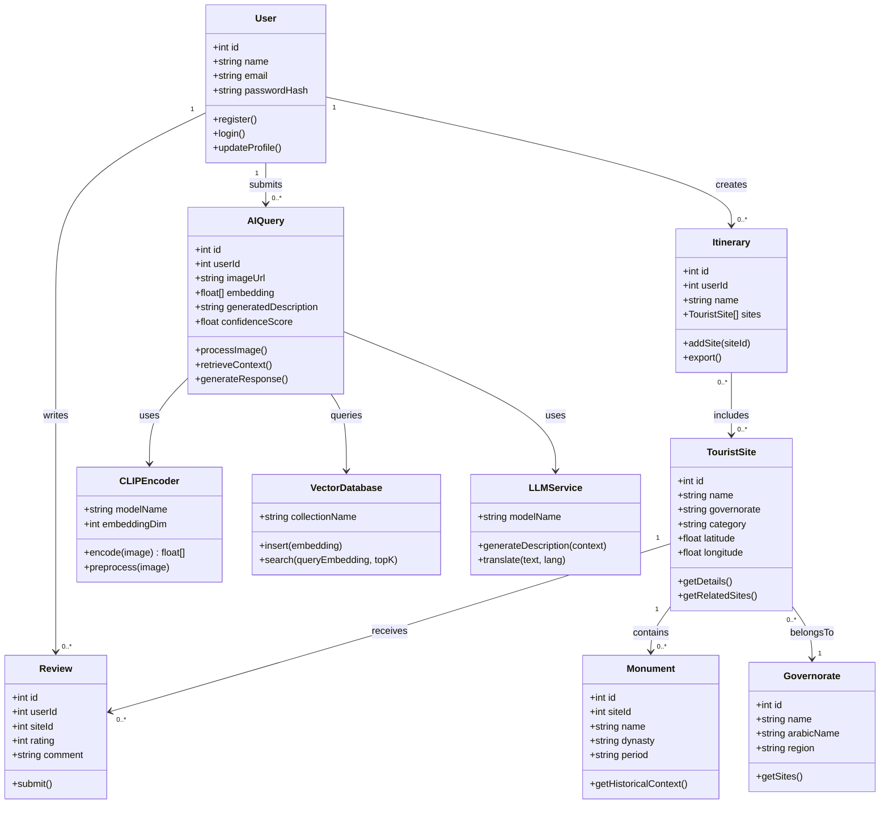

---

### 2. Entity Relationship Diagram

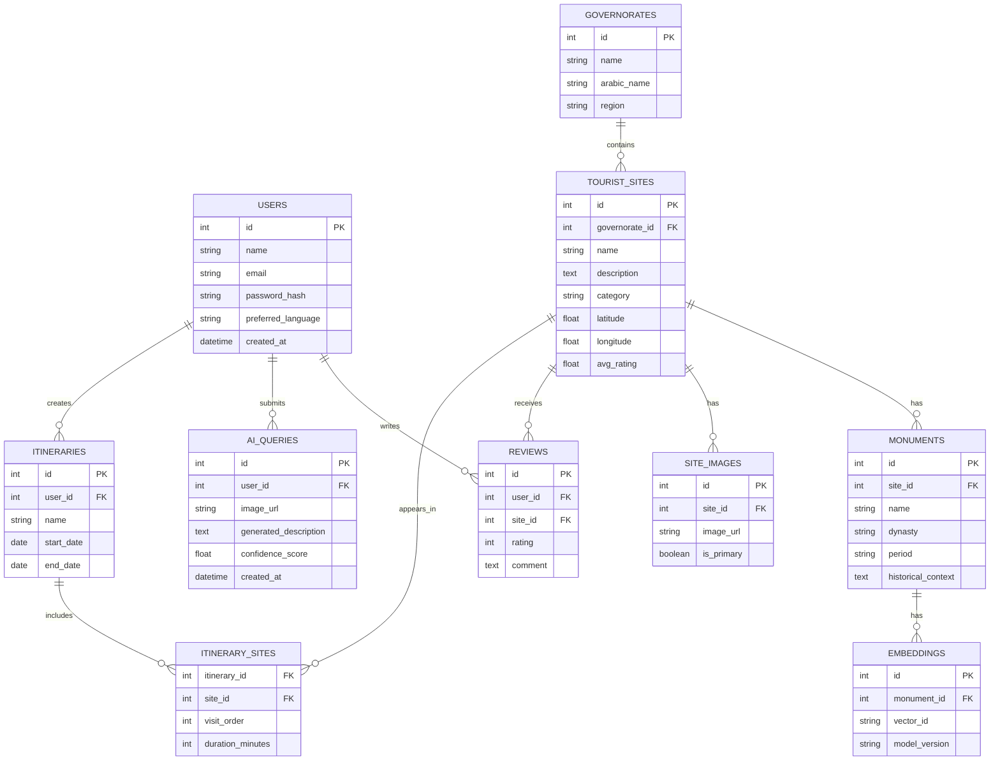

---

### 3. Use Case Diagram

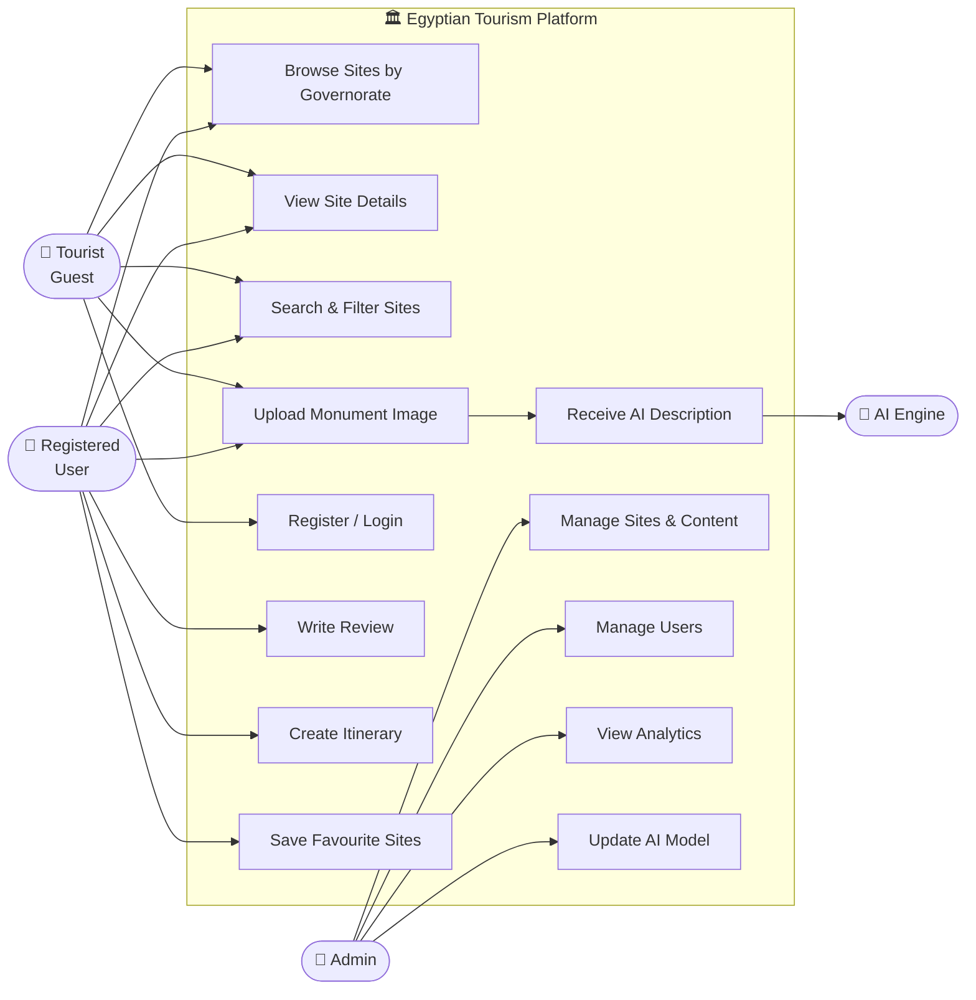

---

### 4. Sequence Diagram — AI Pipeline

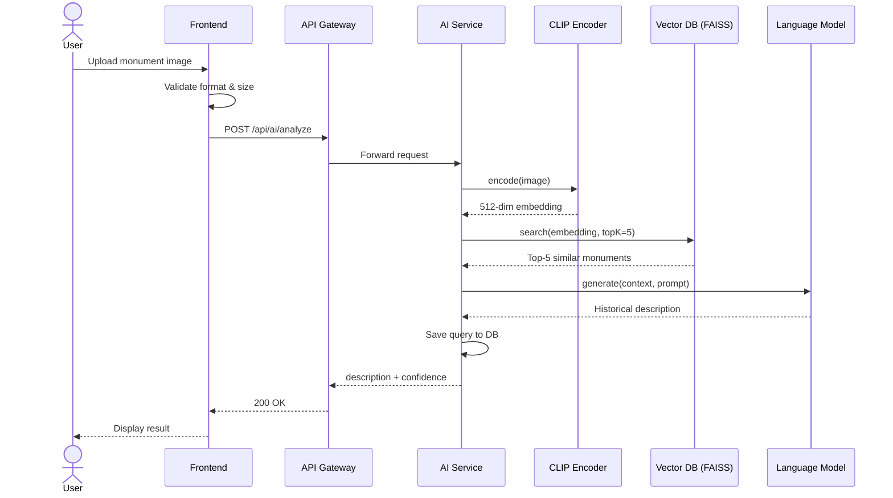

---

### 5. Sequence Diagram — Authentication

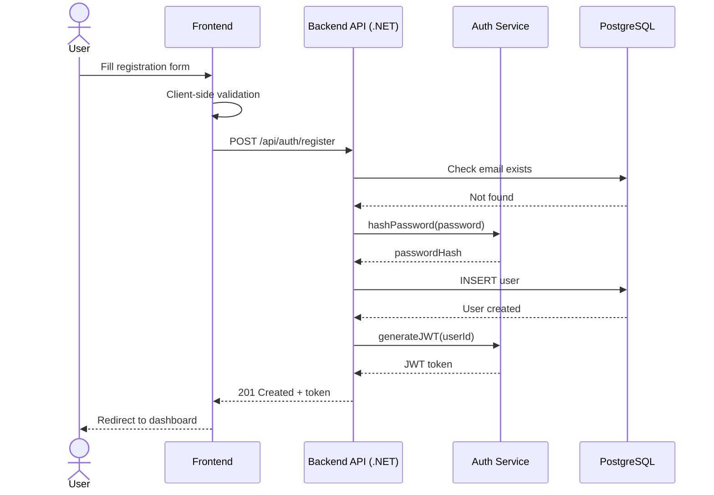

---

### 6. Activity Diagram — AI Analysis

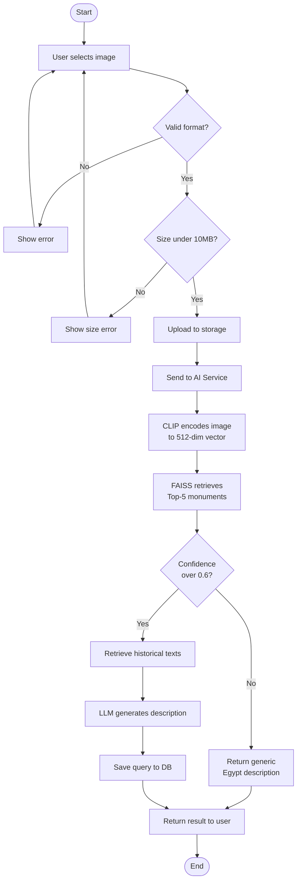

---

### 7. Activity Diagram — Itinerary Planning

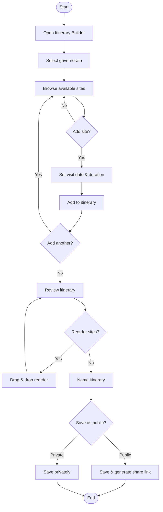

---

### 8. Component Diagram

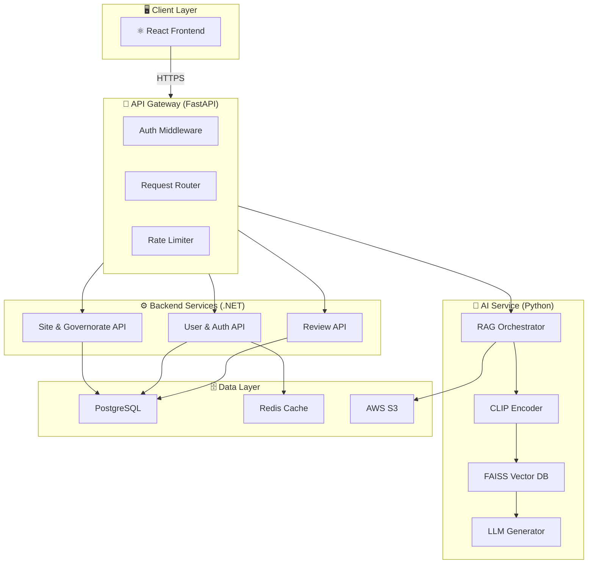

---

### 9. Deployment Diagram

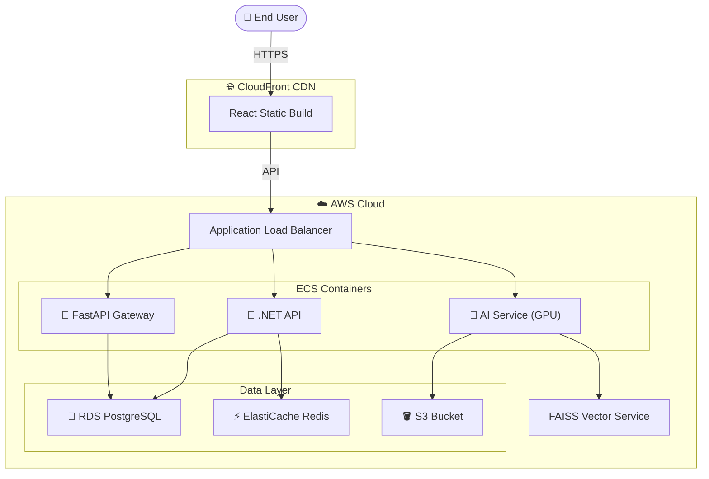

---

### 10. State Machine — AI Query

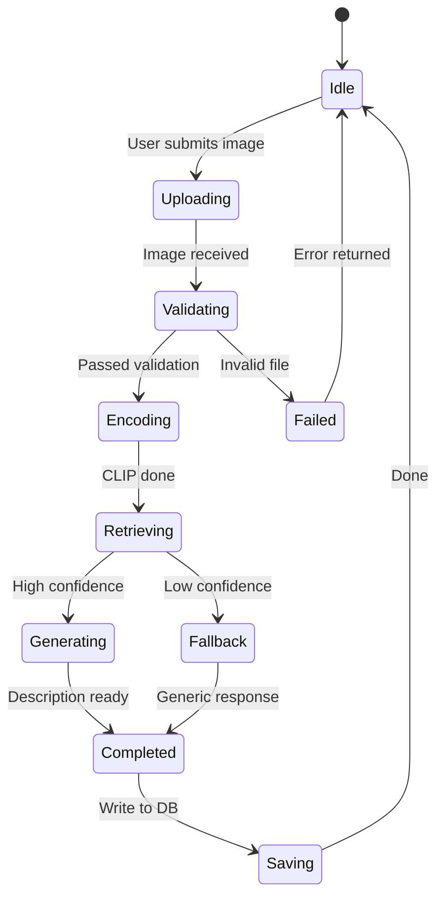

---

### 11. State Machine — User Session

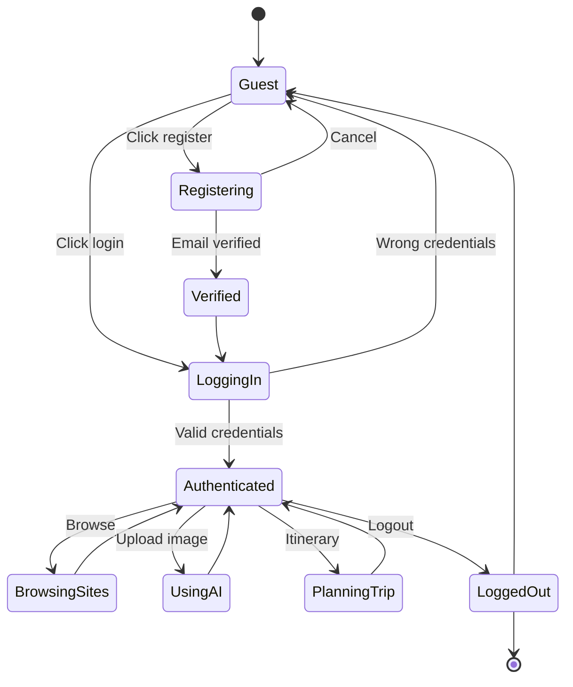

---

## 📁 Project Structure

```
AI-Powered-Egyptian-Tourism-Platform/
│
├── 📁 frontend/                    # React 18 + Vite
│   └── src/
│       ├── components/             # Reusable UI components
│       ├── pages/                  # Home, Explorer, AI Tool, Itinerary
│       ├── hooks/                  # Custom React hooks
│       └── utils/                  # Helper functions
│
├── 📁 backend/                     # .NET 8 REST API
│   ├── Controllers/                # SiteController, UserController, ReviewController
│   ├── Models/                     # Entity models
│   ├── Services/                   # Business logic
│   └── Data/                       # EF Core DbContext & Migrations
│
├── 📁 ai-service/                  # Python AI Pipeline (FastAPI)
│   ├── encoders/clip_encoder.py    # CLIP image encoding
│   ├── retrieval/vector_search.py  # FAISS similarity search
│   ├── generation/llm_generator.py # LLM description generation
│   ├── rag_pipeline.py             # Orchestrates full RAG flow
│   └── requirements.txt
│
├── 📁 data/                        # Tourism Dataset (1,500+ images)
│   ├── monuments/                  # Monument metadata (JSON)
│   ├── embeddings/                 # Precomputed CLIP vectors
│   ├── knowledge-base/             # Historical texts (JSONL)
│   └── scripts/                    # Scraping & preprocessing
│
├── 📁 ml-training/notebooks/       # Google Colab training notebooks
│   ├── 01_data_collection.ipynb
│   ├── 02_clip_indexing.ipynb
│   └── 03_rag_evaluation.ipynb
│
├── 📁 deployment/                  # Docker + AWS configs
│   ├── docker/                     # Dockerfiles per service
│   ├── aws/                        # ECS task definitions
│   └── nginx/                      # Reverse proxy config
│
├── 📁 docs/diagrams/               # UML diagrams (HTML interactive)
├── 📁 .github/workflows/           # GitHub Actions CI/CD
├── docker-compose.yml              # Local dev environment
├── .env.example                    # Environment variables template
└── README.md
```

---

## 🚀 Getting Started

### Prerequisites

- Python 3.12+ · Node.js 20+ · .NET 8 SDK · Docker

### Run with Docker (recommended)

```bash
git clone https://github.com/Ahmedvip62/AI-Powered-Egyptian-Tourism-Platform.git
cd AI-Powered-Egyptian-Tourism-Platform
cp .env.example .env          # fill in your credentials
docker-compose up --build
```

| Service | URL |
|---|---|
| Frontend | http://localhost:3000 |
| .NET API + Swagger | http://localhost:5000/swagger |
| AI Service + Docs | http://localhost:8001/docs |

### Run services individually

```bash
# AI Service
cd ai-service && pip install -r requirements.txt
uvicorn main:app --reload --port 8001

# Frontend
cd frontend && npm install && npm run dev

# Backend
cd backend && dotnet restore && dotnet run
```

---

## 👥 Team

| Name | Role |
|---|---|
| **Ahmed Ramadan** ⭐ | Project Leader & AI Vision + RAG |
| **Osama Abdel-Rahman** | AI Vision + RAG System |
| **Ahmed Yaser** | Backend Development + Deployment |
| **Ahmed Abdelkader** | Backend Development |
| **Menna Mohamed** | Frontend Development (UI/UX) |
| **Amr Mohamed** | Data Collection & ML Model |
| **Hassan Mohamed** | Data Collection & ML Model |

**Academic Supervisor:** Dr. Morad Raafat

---

## 📅 Milestones

| # | Milestone | Timeline | Status |
|---|---|---|---|
| M1 | Research & Planning | Week 1–2 | ✅ Done |
| M2 | Tourism Data Collection | Week 2–4 | ✅ Done |
| M3 | AI Pipeline Development | Week 4–6 | 🔄 In Progress |
| M4 | Website Development | Week 6–8 | 🔄 In Progress |
| M5 | Integration & Testing | Week 8–10 | ⏳ Pending |
| M6 | Deployment & Presentation | Week 10–12 | ⏳ Pending |

---

## 📄 License

MIT License — see [LICENSE](LICENSE) for details.

---

<div align="center">

Made with ❤️ in Egypt &nbsp;·&nbsp; 2025–2026

*Innovation meets Heritage — Preserving the past through the technology of the future* 🏛️

</div>
